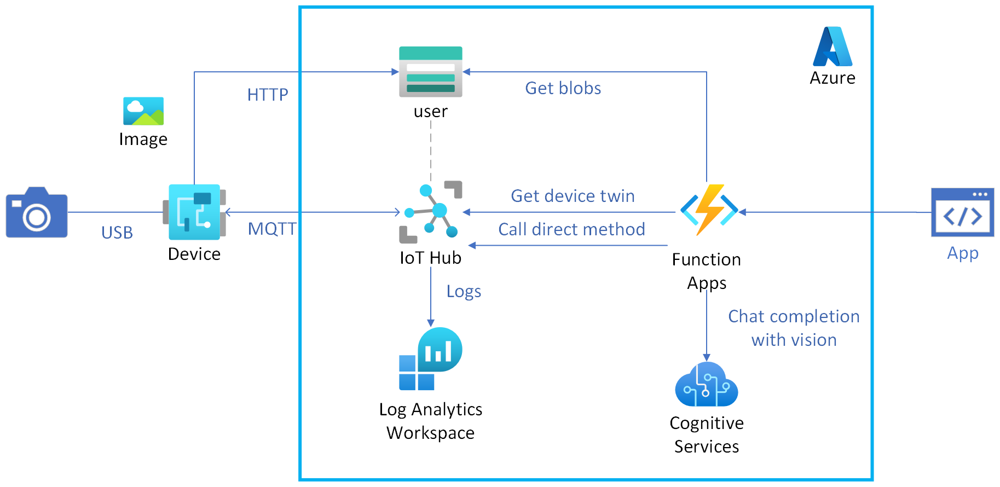

# Azure IoT Hub Messaging

This scenario demonstrates how to handle messages from an Azure IoT Hub using the Azure IoT Hub SDK for Python.

## Architecture

[](../assets/1_architecture.png)

## Setup

After you deploy the Azure IoT Hub, you need to configure IoT Hub file uploads. This is required to upload files from the IoT Hub to the Azure Blob Storage.
Here are the steps to configure IoT Hub file uploads: [Configure IoT Hub file uploads using the Azure portal](https://learn.microsoft.com/azure/iot-hub/iot-hub-configure-file-upload)

## Edge device

To understand how to use the Azure IoT Hub SDK for Python, we provide a script which is supposed to run on the edge device. This demonstrates how to utilize the SDK to send and receive messages from the Azure IoT Hub.
To implement features around the Azure IoT Hub, you can refer to the following scripts.

- [Samples for the Azure IoT Hub Device SDK](https://github.com/Azure/azure-iot-sdk-python/tree/main/samples)

### Upload a file to the Azure Blob Storage

```shell
$ poetry run python scripts/upload_to_blob.py --verbose \
    --file-path ./README.md \
    --blob-name README.md
```

[upload_to_blob.py](https://github.com/Azure/azure-iot-sdk-python/blob/main/samples/async-hub-scenarios/upload_to_blob.py) is a sample code provided by the Azure IoT SDK for Python.

### Capture image

To capture an image from the camera module, you need to run the following command from the edge device.
From the development point of view, it would be better to use a video file to mock the camera module.
So, we provide a script that captures an image from a video file or camera.
Download [vtest.avi](https://github.com/opencv/opencv/blob/4.x/samples/data/vtest.avi) to use it as a video file.

```shell
# From video file to mock camera
$ poetry run python scripts/capture_image.py file --verbose \
    --filename ./docs/assets/vtest.avi \
    --outfile ./docs/assets/image.jpg

# From camera
$ poetry run python scripts/capture_image.py camera --verbose \
    --index 0 \
    --outfile ./docs/assets/image.jpg
```

### Receive direct method requests

To receive direct method requests, you need to run the following command from edge device.
This script handles direct method requests from the Azure IoT Hub.

```shell
$ poetry run python scripts/receive_direct_method.py --verbose
```

[receive_direct_method.py](https://github.com/Azure/azure-iot-sdk-python/blob/main/samples/async-hub-scenarios/receive_direct_method.py) is a sample code provided by the Azure IoT SDK for Python.

## Cloud
