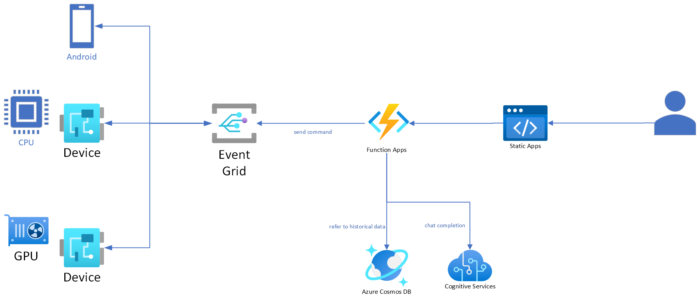

# Azure Event Grid Messaging

This scenario demonstrates how to handle messages from Azure Event Grid.

## Architecture

[](../assets/2_architecture.png)

## Setup

Refer to [Quickstart: Publish and subscribe to MQTT messages on Event Grid Namespace with Azure portal](https://learn.microsoft.com/en-us/azure/event-grid/mqtt-publish-and-subscribe-portal) to create an Event Grid Namespace and a topic.

[Azure-Samples/MqttApplicationSamples](https://github.com/Azure-Samples/MqttApplicationSamples) provides a sample application to publish and subscribe messages to the Event Grid.

### Create CA certificate and key

```shell
step ca init \
    --deployment-type standalone \
    --name MqttAppSamplesCA \
    --dns localhost \
    --address 127.0.0.1:443 \
    --provisioner MqttAppSamplesCAProvisioner
```

### Create client certificate and key

```shell
CLIENT_DIR=configs/clients
mkdir -p $CLIENT_DIR

# Create client certificate and key
CLIENT_NAME=client1
step certificate create $CLIENT_NAME $CLIENT_DIR/$CLIENT_NAME.pem $CLIENT_DIR/$CLIENT_NAME.key \
    --ca ~/.step/certs/intermediate_ca.crt \
    --ca-key ~/.step/secrets/intermediate_ca_key \
    --no-password \
    --insecure \
    --not-after 2400h

# Display certificate fingerprint to register the client on Azure Event Grid Namespace
step certificate fingerprint $CLIENT_DIR/$CLIENT_NAME.pem
```

### Create mosquitto configuration

```shell
MOSQUITTO_DIR=configs/mosquitto
mkdir -p $MOSQUITTO_DIR

# Set up mosquitto
cat ~/.step/certs/root_ca.crt ~/.step/certs/intermediate_ca.crt > $MOSQUITTO_DIR/chain.pem

step certificate create localhost $MOSQUITTO_DIR/localhost.crt $MOSQUITTO_DIR/localhost.key \
    --ca ~/.step/certs/intermediate_ca.crt \
    --ca-key ~/.step/secrets/intermediate_ca_key \
    --no-password \
    --insecure \
    --not-after 2400h

# Run mosquitto
make mosquitto
```

## Demo

```shell
# If you use localhost, run mosquitto first
make mosquitto

# Set the host name of the Event Grid Namespace. If you use localhost, set it to localhost.
HOST_NAME=localhost
# HOST_NAME="EVENT_GRID_NAME.japaneast-1.ts.eventgrid.azure.net"

# Subscribe the topic
poetry run python scripts/event_grid.py subscribe \
    --topic "sample/topic1" \
    --client-name client1 \
    --host-name $HOST_NAME \
    --verbose

# Publish messages to the topic
poetry run python scripts/event_grid.py publish \
    --topic "sample/topic1" \
    --payload "helloworld" \
    --client-name client2 \
    --host-name $HOST_NAME \
    --verbose
```
