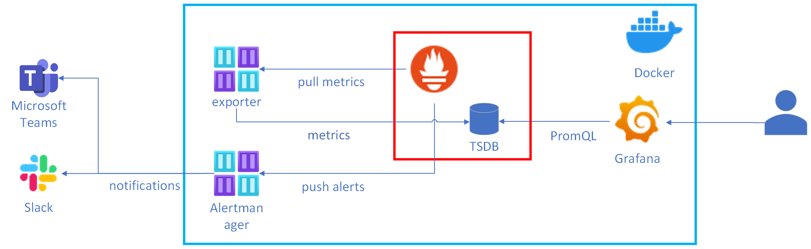
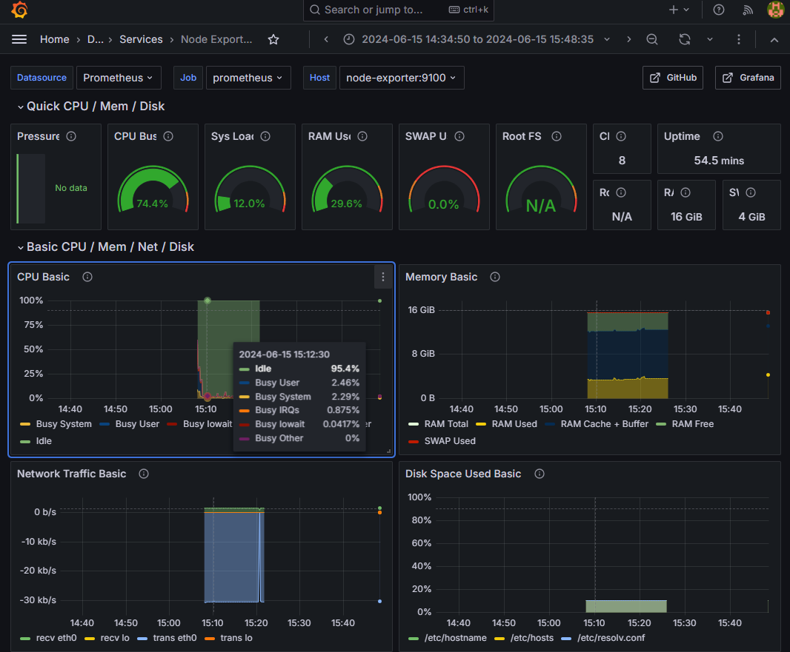
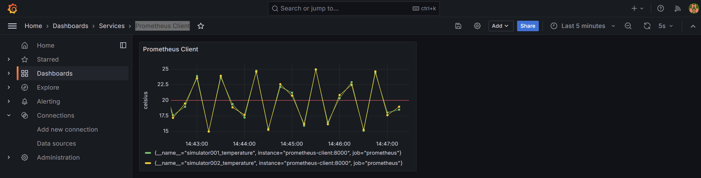

# Generic messaging

This scenario demonstrates a generic scenario of a monitoring service to collect and visualize IoT device metrics using Grafana and Prometheus.

## Prerequisites

- [Docker](https://www.docker.com/)

## Architecture

[](../assets/3_architecture.png)

## Usage

Use Docker Compose in your local environment to build a monitoring service that collects and visualizes IoT device metrics.
The service is defined in [compose.yaml](../../compose.yaml), and the configuration for each service is in the [configs](../../configs) directory.

| Service           | Description                                |
| ----------------- | ------------------------------------------ |
| Grafana           | Dashboard for visualizing metrics          |
| Prometheus        | Monitoring service for collecting metrics  |
| Node Exporter     | Agent for collecting node metrics          |
| Alertmanager      | Monitoring service for alert notifications |
| Prometheus Client | Agent for simulating virtual devices       |

Run the following commands to build the monitoring service in your local environment:

```shell
# Clone the repository and navigate to it
git clone https://github.com/ks6088ts-labs/iot-monitoring.git
cd iot-monitoring

# Build the monitoring service with Docker Compose
docker compose up -d
```

Access Grafana at http://localhost:3000 and log in.
The default username and password are both `admin`.
You will be prompted to change the password upon first login.

After logging in, open Dashboards > Services > Node Exporter Full from the Grafana home to view the node-exporter metrics.

[](../assets/3_node-exporter-full.png)

Open Dashboards > Services > Prometheus Client to view the prometheus client metrics.

[](../assets/3_prometheus-client.png)

## Customization

### Notification Settings

#### Slack

Use [Slack's Incoming Webhooks](https://api.slack.com/messaging/webhooks) to send alerts. Obtain a Slack Webhook URL and set it in the `slack_api_url` field of [alertmanager.yml](../../configs/alertmanager/alertmanager.yml).

### Edit Alert Notifications

Alerts are defined in Alertmanager's [alert_rules.yml](../../configs/prometheus/alert_rules.yml) with the following rules:

- InstanceDown: Triggered when metrics are not collected for a certain period
- APIHighRequestLatency: Triggered when API latency exceeds a threshold for a certain period

Refer to the [Alertmanager Configuration documentation](https://prometheus.io/docs/alerting/latest/configuration/) to edit alert rules.

#### Simulate Node Metrics Changes

To test alerts, change the Node Exporter metrics.
Run the following commands to increase CPU usage and observe metric changes:

```shell
# Log in to the Node Exporter container
docker compose exec node-exporter sh

# Increase CPU load to change metrics
yes > /dev/null &

# Check the PID and kill the process to clean up
ps
kill <PID0>
```

#### Test Alerts

To trigger an InstanceDown alert, stop the Node Exporter with the following commands:

```shell
# Stop the Node Exporter
docker compose stop node-exporter
```

An alert will be triggered after a certain period.

### Implement an Exporter

To collect metrics other than Node Exporter, implement an Exporter.
An Exporter is an HTTP server that provides metrics to Prometheus.

`prometheus-client` container is an HTTP server that provides time-varying metrics.

## References

### Prometheus

- [What is Prometheus?](https://prometheus.io/docs/introduction/overview/)
- [ALERTING RULES](https://prometheus.io/docs/prometheus/latest/configuration/alerting_rules/#alerting-rules)
- [Monitor your home's temperature and humidity with Raspberry Pis and Prometheus](https://opensource.com/article/21/7/home-temperature-raspberry-pi-prometheus)

### Grafana

- [Grafana > Data sources > Prometheus](https://grafana.com/docs/grafana/latest/datasources/prometheus/)
- [All dashboards > Node Exporter Full](https://grafana.com/grafana/dashboards/1860-node-exporter-full/)
- [node-exporter-full.json](https://raw.githubusercontent.com/rfmoz/grafana-dashboards/master/prometheus/node-exporter-full.json)
- [Grafana で Dashboard と DataSource の設定をファイルで管理する[Configuration as Code]](https://zenn.dev/ring_belle/articles/grafana-cac-docker)
- [Prometheus + Node_exporter + Grafana でシステム管理](https://qiita.com/Charon9/items/09745a2ca1279045f10f)
- [Grafana のダッシュボードをエクスポート/インポートしてみた](https://dev.classmethod.jp/articles/export-and-import-grafana-dashboard/)
